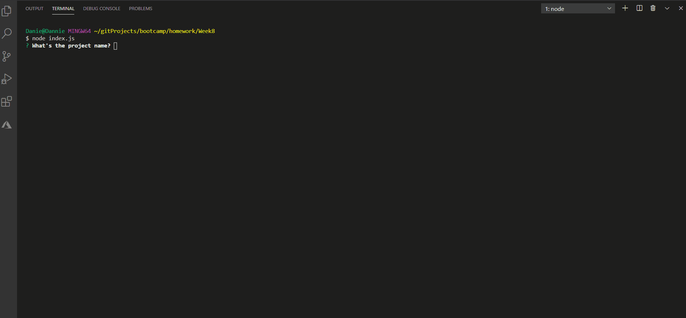

## ReadMe Generator Awesomeness
 
      
### DanielleRBeaty@gmail.com

---
### Description
###### Creating a readme.md from node.js through inputs from the user.
---
## Table of contents
* [How to Install](#how-to-Install)
* [How to Use](#how-to-Use)
* [Licenses](#Licenses)
* [Contributors](#Contributors)
* [Tests](#Tests)
* [Questions](#Questions)
* [App Functionality](#App-Fuctionality)
* [Special Thanks](#Special-Thanks)
---
### How to Install 
###### npm install

### How to Use
###### undefined
---
### Licenses
###### No, license required
---
### Contributors
###### Yes, Danielle Beaty
---
### Tests
###### I have not created any test at this time.
---
### Any Questions?
###### No
---
### App Functionality

---
### Special Thanks

                
